# Light Control Using Hand Gestures

A real-time hand gesture recognition system that controls simulated smart lights using computer vision and deep learning.
The project uses **MediaPipe** for hand landmark extraction and a custom **MLP classifier built with PyTorch** for gesture classification.

---

# Demo

The system recognizes predefined hand gestures through a webcam and performs corresponding light control actions in real time.

Supported gestures:

* `light1`
* `light2`
* `light3`
* `turn_on`
* `turn_off`

Example workflow:

1. User performs a hand gesture
2. MediaPipe extracts 21 hand landmarks
3. Landmarks are normalized and preprocessed
4. MLP classifier predicts gesture class
5. Simulated lights are updated instantly

---

# Project Structure

```bash
.
│   README.md
│   requirements.txt
│
├── Dataset
│   ├── dataset
│   │   ├── landmark_train.csv
│   │   ├── landmark_val.csv
│   │   └── landmark_test.csv
│   │
│   ├── sign_img
│   │   ├── light1.jpg
│   │   ├── light2.jpg
│   │   ├── light3.jpg
│   │   ├── turn_on.jpg
│   │   └── turn_off.jpg
│   │
│   └── hand_gesture.yaml
│
├── Model
│   └── best_model.pth
│
├── Notebook
│   └── Hand_controlling_MLP_Training.ipynb
│
├── report
│   ├── train_val_loss_acc.png
│   ├── light1_test.png
│   ├── light2_test.png
│   ├── light3_test.png
│   ├── turn_on_test.png
│   ├── turn_off_test.png
│   └── no_hand_test.png
│
└── src
    ├── detect_simulation.py
    ├── generate_landmark_data.py
    │
    └── utils
        ├── data_loader.py
        ├── detector.py
        ├── extract_class.py
        └── NeuralNetwork.py
```

---

# Features

* Real-time hand gesture recognition
* Webcam-based interaction
* Custom dataset generation pipeline
* Hand landmark extraction using MediaPipe
* Lightweight MLP classifier
* Gesture confidence thresholding
* Data normalization and augmentation
* Simulated smart light control interface
* Train / validation / test evaluation pipeline

---

# Technology Used

## Programming Language

* Python

## Deep Learning Framework

* PyTorch

## Computer Vision

* OpenCV
* MediaPipe

## Data Processing

* NumPy
* Pandas

## Visualization & Evaluation

* Matplotlib
* TorchMetrics

---

# Methodology

## 1. Hand Landmark Detection

The project uses MediaPipe Hands to detect and track hand landmarks from webcam frames.

Each detected hand produces:

* 21 landmarks
* Each landmark contains:

  * x coordinate
  * y coordinate
  * z coordinate

Total input feature dimension:

```text
21 × 3 = 63 features
```

## 2. Dataset Collection Procedure

The dataset was collected manually using a custom real-time recording script:

```bash
src/generate_landmark_data.py
```

The script uses a webcam and MediaPipe Hands to continuously extract hand landmarks while the user performs predefined gestures.

### Gesture Mapping

Each keyboard key corresponds to a gesture class:

| Keyboard Key | Gesture Label |
| ------------ | ------------- |
| `a`          | `turn_off`    |
| `b`          | `light1`      |
| `c`          | `light2`      |
| `d`          | `light3`      |
| `e`          | `turn_on`     |

### Data Recording Workflow

#### Step 1 — Start Recording

Press a keyboard key to begin recording samples for a specific gesture class.

Example:

```text
Press b → Start collecting samples for light1
```

While recording:

* The webcam continuously captures frames
* MediaPipe extracts 21 hand landmarks
* Landmark coordinates are stored into CSV format
* The user moves their hand across different screen positions and orientations

This movement strategy helps improve:

* spatial robustness
* viewpoint invariance
* model generalization

#### Step 2 — Stop Recording Current Gesture

Press the same key again to stop recording the current gesture.

Example:

```text
Press b again → Stop collecting light1 samples
```

The script prevents switching labels while recording to avoid annotation mistakes.

#### Step 3 — Finish Current Dataset Split

After collecting all gesture classes for the current dataset split, press:

```text
q
```

to close the current recording session and automatically move to the next dataset split.

Collection order:

```text
train → validation → test
```

### Dataset Split Strategy

Three separate datasets were collected:

| Split      | Collection Duration   |
| ---------- | --------------------- |
| Train      | ~20 seconds per class |
| Validation | ~20 seconds per class |
| Test       | ~15 seconds per class |

During collection, the hand was intentionally moved through:

* different screen locations
* multiple hand orientations
* varying camera distances
* diverse viewing angles

This increases the diversity of landmark distributions and improves robustness in real-world inference.

### Stored Data Format

Each dataset sample contains:

```text
[label, x1, y1, z1, x2, y2, z2, ..., x21, y21, z21]
```

Where:

* `label` is the gesture class ID
* `(x, y, z)` are MediaPipe landmark coordinates
* 21 landmarks are extracted for each hand

Total feature dimension:

```text
21 landmarks × 3 coordinates = 63 features
```

### Example Collection Scenario

Example workflow for collecting the `light2` gesture:

1. Run the dataset generation script
2. Press `c`
3. Perform the `light2` gesture
4. Move the hand around the screen for approximately 20 seconds
5. Press `c` again to stop recording
6. Repeat for all gesture classes
7. Press `q` to finish the current dataset split and continue to the next split

<p align="center">
  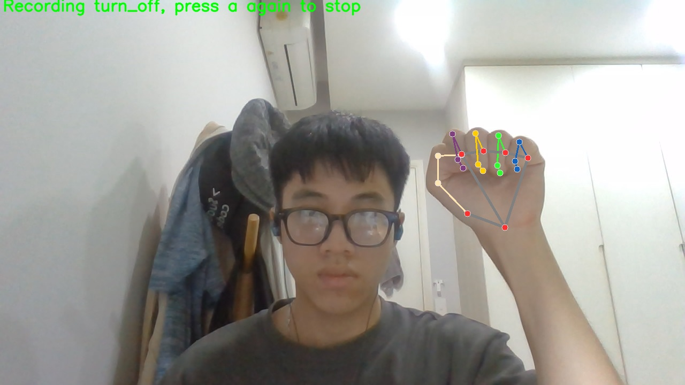
</p>

<p align="center">
  <em>Collecting turn_off gesture data</em>
</p>

<p align="center">
  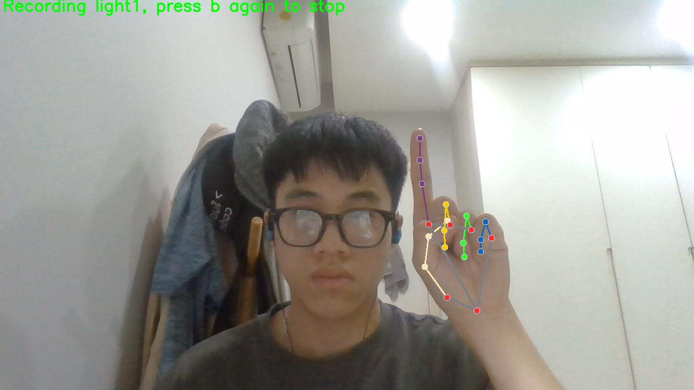
</p>

<p align="center">
  <em>Collecting light1 gesture data</em>
</p>

<p align="center">
  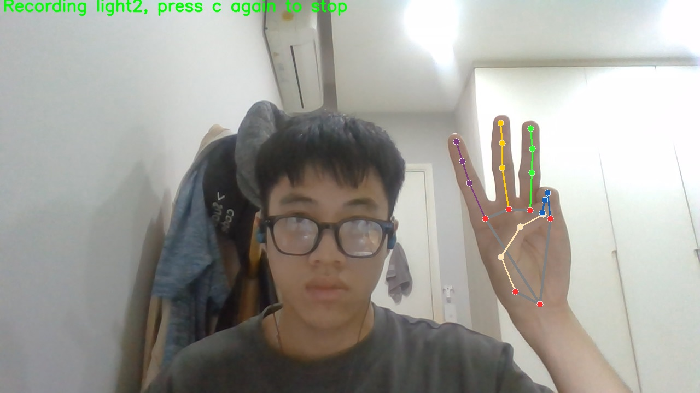
</p>

<p align="center">
  <em>Collecting light2 gesture data</em>
</p>

<p align="center">
  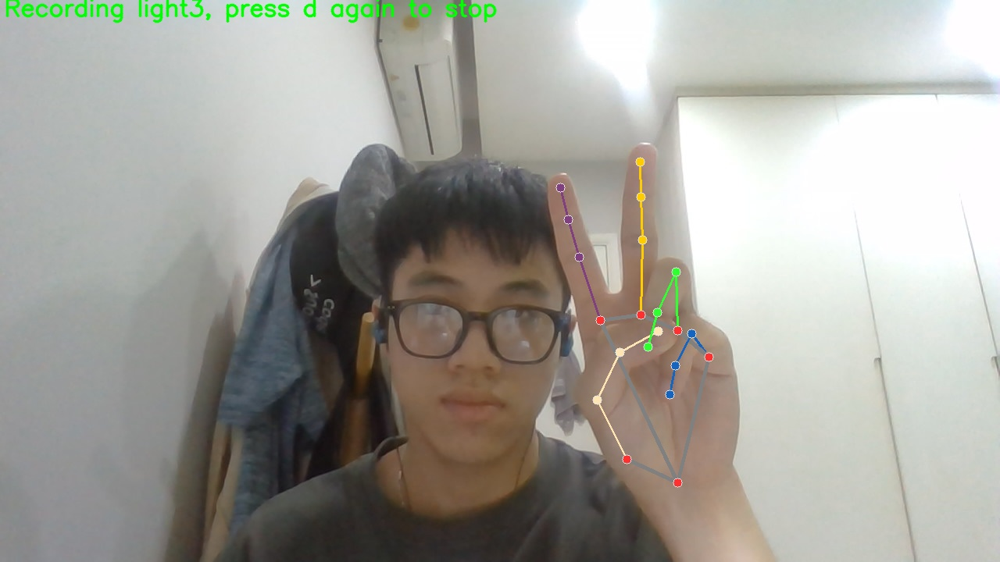
</p>

<p align="center">
  <em>Collecting light3 gesture data</em>
</p>

<p align="center">
  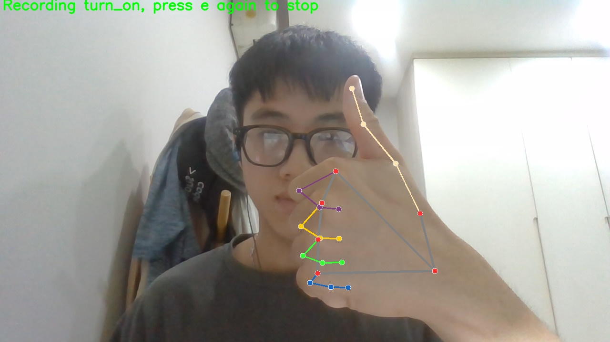
</p>

<p align="center">
  <em>Collecting turn_on gesture data</em>
</p>

## 3. Data Preprocessing

Before training, landmarks are normalized using:

### Relative Coordinate Transformation

All landmarks are converted relative to the wrist position.

```python
relative_coords = coords - wrist_coord
```

### Scale Normalization

Coordinates are divided by the maximum landmark distance.

```python
relative_coords = relative_coords / max_distance
```

Benefits:

* Translation invariant
* Scale invariant
* Better generalization

## 4. Data Augmentation

Gaussian noise is added during training:

```python
noise = np.random.normal(0, 0.005, relative_coords.shape)
```

Purpose:

* Improve robustness
* Reduce overfitting
* Simulate real-world hand variations

## 5. Model Architecture

The gesture classifier is a lightweight Multi-Layer Perceptron (MLP).

Architecture:

```text
Input Layer: 63

Hidden Layer 1:
- Linear(63 → 64)
- BatchNorm
- ReLU
- Dropout(0.15)

Hidden Layer 2:
- Linear(64 → 32)
- BatchNorm
- ReLU
- Dropout(0.15)

Output Layer:
- Linear(32 → Number of Classes)
```

## 6. Training Strategy

### Loss Function

```python
CrossEntropyLoss
```

### Optimizer

The model was trained using the Adam optimizer:

```python
optimizer = optim.Adam(
    model.parameters(),
    lr=0.0005,
    weight_decay=1e-4
)
```

#### Why an Optimizer Is Needed

During neural network training, the optimizer updates model parameters based on gradients computed from the loss function.

Its purpose is to:

* minimize prediction error
* improve model performance
* guide the network toward optimal weights

Without an optimizer, the neural network cannot learn from data.

#### Adam Optimizer

This project uses:

```python
Adam
```

which stands for:

```text
Adaptive Moment Estimation
```

Adam is one of the most widely used optimizers in deep learning because it combines:

* fast convergence
* stable training
* adaptive learning rates

##### How Adam Works

Adam improves standard gradient descent by tracking:

###### 1. First Moment (Mean of Gradients)

Adam computes an exponential moving average of gradients:

```text
m_t
```

This acts like momentum and helps the optimizer move consistently toward better regions.

Benefits:

* smoother optimization
* reduced oscillation
* faster convergence

###### 2. Second Moment (Variance of Gradients)

Adam also tracks the squared gradients:

```text
v_t
```

This estimates gradient variance and allows adaptive step sizes.

Benefits:

* large gradients → smaller updates
* small gradients → larger updates

This makes training more stable across different parameters.

##### Why Adam Was Suitable for This Project

This project uses:

* a relatively small MLP architecture
* normalized landmark features
* real-time gesture classification

Adam was a good choice because it:

* converges quickly on small datasets
* works well with noisy gradients
* handles different feature scales effectively
* requires minimal manual tuning

This allowed the model to achieve stable convergence while maintaining efficient training time.

##### Learning Rate

```python
lr=0.0005
```

The learning rate determines how large each parameter update is during optimization.

A smaller learning rate:

* improves stability
* reduces overshooting
* enables smoother convergence

For this project:

```text
0.0005
```

provided a good balance between:

* training speed
* convergence stability
* final model accuracy

##### Weight Decay (L2 Regularization)

```python
weight_decay=1e-4
```

Weight decay is a regularization technique that penalizes excessively large weights.

It adds an additional penalty term during optimization:

```text
Loss = Original Loss + λ × ||W||²
```

Purpose:

* reduce overfitting
* improve generalization
* prevent unstable large parameter values

##### Why Weight Decay Was Important

Because the project uses:

* a relatively small custom dataset
* a lightweight neural network

the model could potentially memorize training samples.

Using weight decay helped:

* improve robustness
* reduce overfitting
* stabilize training

especially when combined with:

* Dropout
* Batch Normalization
* Data Augmentation
* Early Stopping

##### Training Stability

The combination of:

```text
Adam + CosineAnnealingLR + Weight Decay
```

created a stable optimization pipeline that allowed the model to:

* converge smoothly
* generalize well on unseen gestures
* maintain reliable real-time prediction performance

### Learning Rate Scheduler

The project uses the following learning rate scheduler:

```python
scheduler = CosineAnnealingLR(
    optimizer,
    T_max=100,
    eta_min=1e-6
)
```

#### Why Use a Learning Rate Scheduler?

During neural network training, the learning rate controls how large each parameter update is during gradient descent.

A fixed learning rate can cause problems:

* Too large:

  * unstable training
  * oscillation around minima
  * failure to converge

* Too small:

  * very slow learning
  * poor optimization
  * getting stuck early

Instead of keeping the learning rate constant, this project gradually decreases it during training.

This helps the model:

* learn quickly in early epochs
* stabilize in later epochs
* converge more smoothly
* improve generalization performance

#### Cosine Annealing Learning Rate

`CosineAnnealingLR` decreases the learning rate following a cosine-shaped curve.

The scheduler starts with a relatively high learning rate and slowly reduces it toward a minimum learning rate.

The learning rate update follows:

```text
lr_t = eta_min + 0.5 × (lr_max − eta_min) × (1 + cos(π × t / T_max))
```

Behavior:

* Early training:

  * larger learning rate
  * faster exploration of parameter space

* Mid training:

  * smoother optimization
  * reduced oscillation

* Late training:

  * very small updates
  * fine-tuning near optimal minima

This often produces better convergence than abruptly reducing the learning rate.

#### Meaning of Parameters

##### `T_max=100`

```python
T_max=100
```

This defines the number of epochs required for the learning rate to decay from:

```text
initial learning rate → eta_min
```

In this project:

* the cosine decay cycle lasts 100 epochs
* after 100 epochs, the learning rate reaches its minimum value

The learning rate decreases smoothly across training instead of dropping suddenly.

##### `eta_min=1e-6`

```python
eta_min=1e-6
```

This is the minimum learning rate allowed during training.

Why not reduce learning rate to zero?

Because:

* the model still needs tiny parameter updates
* complete zero learning rate would stop learning entirely

Using a very small value such as:

```text
0.000001
```

allows the model to continue fine-tuning weights near convergence.

#### Why CosineAnnealingLR Was Suitable for This Project

This project uses a lightweight MLP classifier trained on hand landmark data.

The scheduler was beneficial because:

* landmark features are relatively stable
* the model converges quickly
* smooth learning rate decay prevents overshooting
* small late-stage updates improve gesture classification stability

Combined with:

* Batch Normalization
* Dropout
* Weight Decay
* Early Stopping

the scheduler helped improve training stability and generalization performance.

### Regularization

* Dropout
* Weight decay
* Data augmentation

### Early Stopping

Training stops automatically when validation loss stops improving.

---

# Results

## Performance Metrics

The model was evaluated using:

* Accuracy
* Macro F1-score
* Confusion Matrix

The lightweight MLP achieved strong performance while maintaining real-time inference speed.

## Training and Validation Curves

<p align="center">
  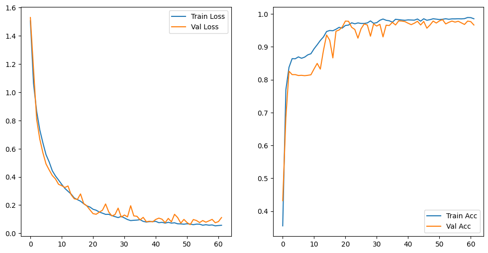
</p>

<p align="center">
  <em>Training and validation loss/accuracy curves during model training.</em>
</p>

The curves demonstrate:

* Stable convergence
* Minimal overfitting
* Good generalization capability

## Test Set Performance

The trained MLP classifier achieved strong performance on the unseen test dataset.

### Evaluation Metrics

| Metric         | Score      |
| -------------- | ---------- |
| Test Accuracy  | **95.37%** |
| Macro F1-Score | **95.21%** |

These results indicate that the model generalizes well to unseen hand gestures while maintaining stable real-time inference performance.

### Confusion Matrix

```text
[[283   0   0   0   0]
 [  1 312   1   0   0]
 [  0   0 303   4   0]
 [  0   0  67 241   0]
 [  0   0   0   0 366]]
```

### Analysis of Results

The confusion matrix shows that most gesture classes were classified with very high accuracy.

#### Strongly Classified Gestures

The model achieved near-perfect classification performance for:

* `turn_off`
* `light1`
* `turn_on`

These gestures produced highly separable landmark patterns.

#### Main Source of Misclassification

Most prediction errors occurred between:

```text
light2 ↔ light3
```

This suggests that these two gestures contain relatively similar hand landmark configurations.

Example:

* similar finger positions
* overlapping hand orientations
* close geometric structures

Despite this, the model still maintained strong overall classification performance.

### Generalization Capability

The model was evaluated on a separately collected test set where hand positions and orientations differed from training samples.

The strong performance demonstrates that the preprocessing pipeline successfully improved:

* translation invariance
* scale invariance
* robustness to viewpoint variation

### Real-Time Performance

The lightweight MLP architecture enables:

* low inference latency
* efficient CPU execution
* smooth real-time webcam interaction

This makes the system suitable for lightweight edge-AI applications and interactive gesture-based interfaces.

#### Real-Time Inference

The system performs real-time prediction from webcam input with low latency.

# Prediction pipeline:

```text
Webcam → MediaPipe → Landmark Processing → MLP → Light Control
```

## Gesture Commands

| Gesture  | Action              |
| -------- | ------------------- |
| light1   | Turn on Light 1     |
| light2   | Turn on Light 2     |
| light3   | Turn on Light 3     |
| turn_on  | Turn on all lights  |
| turn_off | Turn off all lights |

<p align="center">
  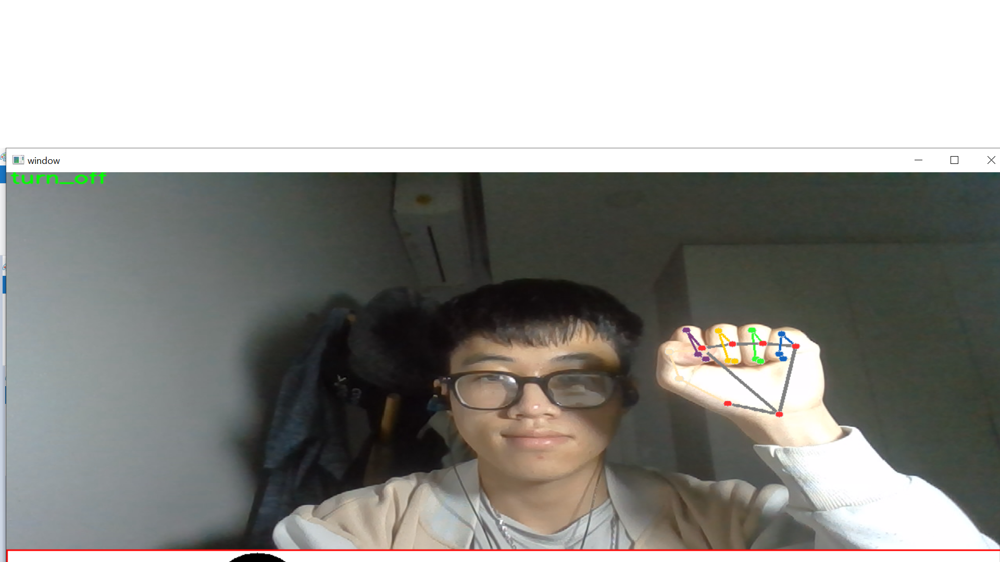
</p>

<p align="center">
  <em>Turn off gesture</em>
</p>

<p align="center">
  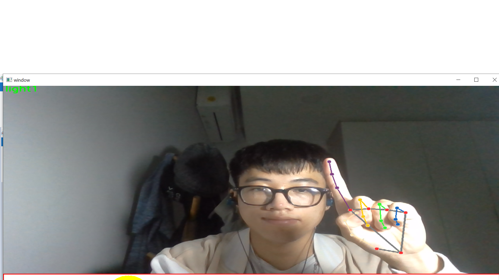
</p>

<p align="center">
  <em>Light 1 gesture</em>
</p>

<p align="center">
  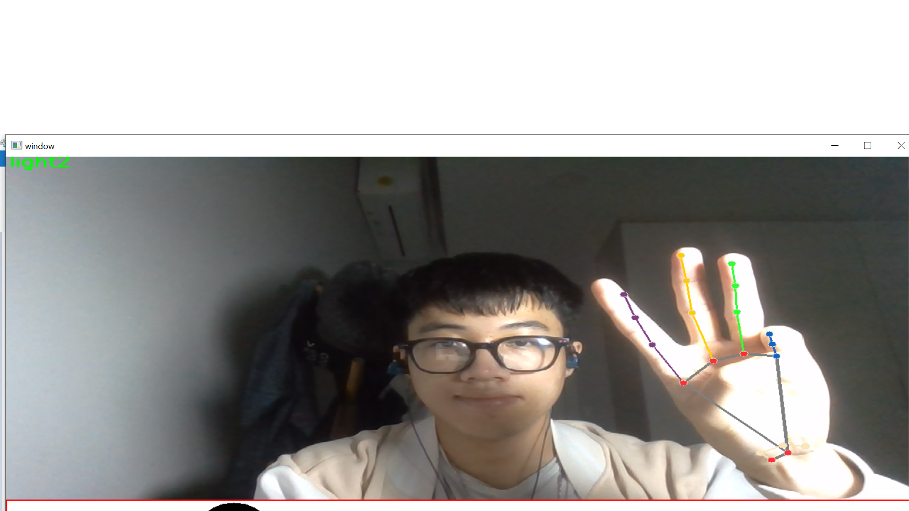
</p>

<p align="center">
  <em>Light 2 gesture</em>
</p>

<p align="center">
  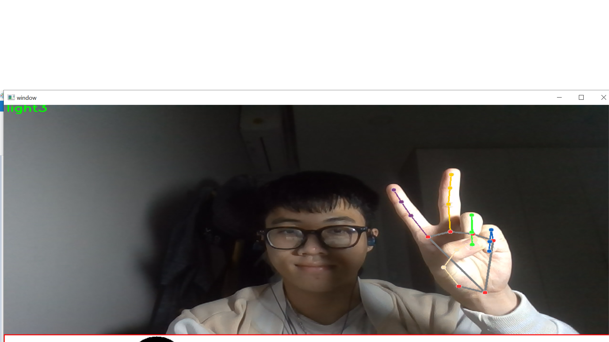
</p>

<p align="center">
  <em>Light 3 gesture</em>
</p>

<p align="center">
  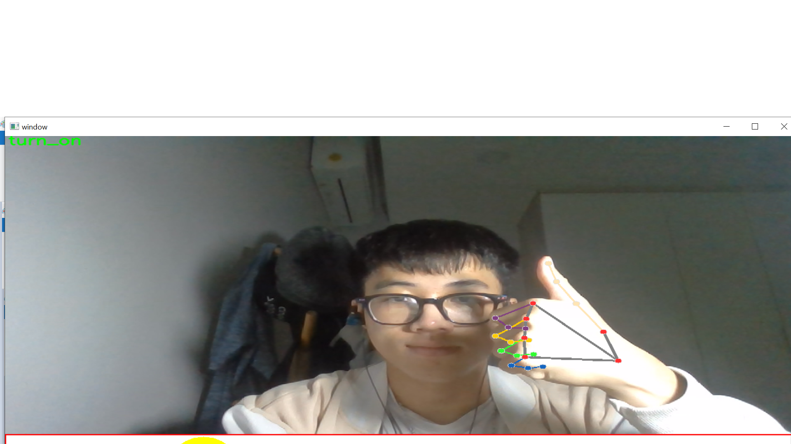
</p>

<p align="center">
  <em>Turn on gesture</em>
</p>

---

# Quick Start

## 1. Clone Repository

```bash
git clone https://github.com/ntq05/light-controlling-using-hand-gestures.git
cd light-controlling-using-hand-gestures
```

## 2. Create Conda Environment

```bash
conda create --prefix ./env python=3.10
```

## 3. Install dependencies

```bash
pip install -r requirements.txt
```

## 4. Run Real-Time Detection

```bash
cd src
python detect_simulation.py
```

Press:

```text
q
```

to exit.

## 5. Training the Model

### Generate Dataset

```bash
cd src
python generate_landmark_data.py
```

The script will automatically create:

* training set
* validation set
* test set

### Train the Model

Open the notebook on Google Colab:

```bash
Notebook/Hand_controlling_MLP_Training.ipynb
```

Then run all notebook cells.

The best model checkpoint will be saved as:

```bash
Model/best_model.pth
```

---

# Future Improvements

Possible extensions for this project:

* Improve class separation between light2 and light3
* Add more gesture classes
* Integrate with real IoT devices
* Deploy using Raspberry Pi
* Use Temporal Models (LSTM/Transformer)
* Improve robustness under occlusion
* Add multi-hand support
* Deploy as a web application

---

# Challenges & Learnings

Through this project, I learned:

* Real-time computer vision pipelines
* Landmark-based gesture recognition
* Data preprocessing for geometric invariance (Applying landmark normalization techniques for spatial invariance)
* Adding Gaussian noise augmentation to improve model robustness
* Building lightweight deep learning systems
* Training and evaluating classification models
* Designing interactive AI applications
* Building custom dataset collection pipelines for computer vision tasks

---

# Why MLP Instead of Large Models?

This project intentionally uses a lightweight MLP architecture because:

* Hand landmarks are already high-level structured features
* MLP inference is extremely fast
* Lower computational cost
* Easier deployment on edge devices
* Sufficient for small gesture classification tasks

This design choice enables real-time performance without requiring heavy GPU resources.

---

# Acknowledgements

* MediaPipe Hands
* PyTorch
* OpenCV

